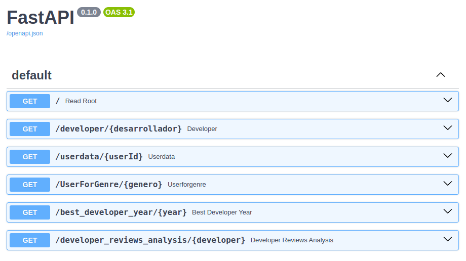

# PI_ML_OPS
HENRY 
PROYECTO INDIVIDUAL Nº1 
Machine Learning Operations

      

# PROYECTO INDIVIDUAL Nº1: Machine Learning Operations

## Introducción

Este proyecto individual, desarrollado para el curso de Ciencia de Datos del bootcamp Henry, simula la creación de un sistema de recomendación de videojuegos para la plataforma Steam. El objetivo es presentar un MVP (Minimum Viable Product), el cual estará compuesto por:

- Un análisis de sentimiento de los comentarios de los usuarios sobre los videojuegos para determinar su sentimiento (positivo, neutral o negativo).
- Un modelo de Machine Learning basado en similitud de items que recomienda videojuegos similares a un videojuego dado.
- Una API con el framework FastAPI que ofrece seis endpoints:
  - __developer__. Obtiene la cantidad de videojuegos de un desarrollador y el porcentaje de gratuitos.
  - __userdata__. Muestra el usuario que más ha gastado, la cantidad de juegos que ha comprado y las recomendaciones que ha realizado.
  - __UserForGenre__. Encuentra el usuario con más horas jugadas en un género específico y una lista de esas horas por año.
  - __best_developer_year__. Obtiene los tres mejores desarrolladores de videojuegos por año.
  - __developer_reviews_analysis__. Muestra el total de comentarios positivos y negativos de un desarrollador.
  - __recomendacion_juego__. Recomienda 5 juegos similares al videojuego consultado.

## Contexto
El estudiante toma el rol de un *Data Engineer* que recibe datos de la empresa Steam para construir el sistema. Sin embargo, la calidad de los datos es deficiente, por lo que se requiere un trabajo de limpieza, transformación y mejora antes de poder utilizarlos.

## Tareas

1) Análisis de datos
   - Se realiza una limpieza exhaustiva de los datos, eliminando valores nulos, inconsistencias y duplicados.
   - Se transforman los datos para que sean compatibles con los modelos de Machine Learning y la API.
   - Se exploran los datos para comprender las características de los videojuegos, los usuarios y sus comentarios.

> [!NOTE]
> Los datos han sido reducidos tomando en cuenta la capacidad (realmente poca) del servidor Render en donde será desplegada la API.

2) Análisis de sentimiento
   - Se utiliza un modelo de Machine Learning para clasificar los comentarios de los usuarios como positivos, neutrales o negativos.
   - Se analiza la distribución de los sentimientos para cada videojuego y desarrollador.

3) Desarrollo de API
   - Se implementa la API con FastAPI, siguiendo las mejores prácticas de desarrollo.
   - La API ofrece seis endpoints para acceder a la información del sistema.
   - Se documenta la API para facilitar su uso por parte de otros desarrolladores.

4) Modelo de recomendación
   - Se implementa un modelo de Machine Learning basado en la similitud de items para recomendar videojuegos.
   - Se seleccionan las características más relevantes para la recomendación.
   - Se entrena y evalúa el modelo.

## Fuente de los datos

Contamos con tres archivos de datos comprimidos de formato JSON que fueron suministrados por STEAM:

Diccionario 'steam_games.gz.json' 👈

<pre>
   COLUMNA         TIPO        DESCRIPCIÓN
   ----------------------------------------------------------------------------------------------------------------
   publisher       Str         El indicador en cuestión. Ej. ‘Migración Neta’ o ‘Población activa’
   genres          Str         Código del indicador (serie)
   app_name        Str         Nombre del país o región del indicador (serie)
   title           Str         Código del país o región
   url             Float       Total del indicador para el año 2000
   release_date    Float       Total del indicador para el año 2001
   tags	           Str 	       [Simulation, Indie, Action, Adventure, Funny, Open World, First-Person, Free to Play]
   discount_price  Float       [22.66, 0.49, 0.69]
   reviews_url	   Str         Reviews de contenido
   specs           Str         Especificaciones	[Multi-player, Cross-Platform Multiplayer, Downloadable Content]
   price           Float       Precio del contenido [4.99, 9.99, Free to Use, Free to Play]
   early_access	   Boolean     acceso temprano	[False, True]
   id              Int         identificador unico de contenido	[761140, 643980, 670290]
   developer       Str         Desarrollador [Kotoshiro, Secret Level SRL, Poolians.com]
   metascore       Int         Score por metacritic [80, 74, 77, 75]
</pre>

Diccionario 'user_reviews.gz.json' 👈

<pre>
   COLUMNA         TIPO        DESCRIPCIÓN
   -----------------------------------------------------------------------------------------------
   user_id         Int         identificador unico de usuario [76561197970982479, evcentric, maplemage]
   user_url        Str         URL perfil del usuario http://steamcommunity.com/id/evcentric
   reviews         Str         Review de usuario en formato Json 
                               {
                                 'funny': '',
                                 posted': 'Posted September 8, 2013.',
                                 'last_edited': '',
                                 'item_id': '227300',
                                 'helpful': '0 of 1 people (0%) found this review helpful',
                                 'recommend': True,
                                 'review': "For a simple ... and I had a bit of fun with it."
                               },
</pre>

Diccionario 'user_items.gz.json' 👈

<pre>
   COLUMNA         TIPO        DESCRIPCIÓN
   -----------------------------------------------------------------------------------------------
   user_id         Int         Identificador unico de usuario	[76561197970982479, evcentric, maplemage]
   user_url        Str         URL perfil del usuario http://steamcommunity.com/id/evcentric
   items           Str         Items de usuario en formato Json
                               {
                                 'item_id': '273350',
                                 'item_name': 'Evolve Stage 2',
                                 'playtime_forever': 58,
                                 'playtime_2weeks': 0
                               }
</pre>

## Estructura de directorios

A continuación, se presenta la estructura de directorios del proyecto:

__PI_ML_OPS__ 
├── __src__: Ubicación de los archivos fuente en un proyecto. 
|&emsp; ├── __assets__: Para almacenar las imágenes y otros recursos estáticos. 
│&emsp; ├── __datasource__: Contiene los datos originales proporcionados por Steam. 
│&emsp; │&emsp; └── __render__: Contiene los datos que serán subidos a la plataforma Render 
│&emsp; │ 
│&emsp; ├── __etl__: Cuadernos con código para la limpieza, transformación y carga de datos. 
│&emsp; ├── __model__: Almacena los modelos de Machine Learning (si se utilizan). 
│&emsp; └── __utils__: Funciones y utilidades generales del proyecto. 
│ 
├── __main.py__: Script principal que ejecuta el proyecto e implementa la API con FastAPI. 
├── __README.md__: Este archivo de descripción del proyecto. 
└── __requirements.txt__: Lista de dependencias del proyecto para Render. 

## El flujo de trabajo

Empezamos por analizar la fuente de los datos desde el punto de vista del ETL y el dato puro. Aquí, el enfoque es encontrar datos repetidos, nulos y tipo correctos de datos, sobre todo con la intención de disminuir el espacio que estos ocuparán en memoria.
Para estas tarea utilizamos cuadernos Python alojados dentro del directorio ‘etl’. Un cuaderno con el prefijo ‘etl_’ para cada fuente de datos:

└── __etl__ 
&emsp;&nbsp;&nbsp; ├── __etl_steam_games.ipynb__ 
&emsp;&nbsp;&nbsp; ├── __etl_user_items.ipynb__ 
&emsp;&nbsp;&nbsp; └── __etl_user_reviews.ipynb__ 

Los datos de origen están comprimidos en tres archivos JSON en el directorio ‘datasource’:

└── __datasource__ 
&emsp;&nbsp;&nbsp; ├── __steam_games.json.gz__ 
&emsp;&nbsp;&nbsp; ├── __users_items.json.gz__ 
&emsp;&nbsp;&nbsp; └── __user_reviews.json.gz__ 

En los cuadernos ‘etl’, los datos fueron capturados desde el formatos JSON comprimido hacia estructuras de tipo dataframe Pandas, siendo transformados en diferentes etapas dentro de esas mismas estructuras y posteriormente persistidas en archivos comprimidos CSV. Esta persistencia fue etiquetada como chewed (‘masticado’ en inglés) y almacenada en el directorio ‘datasource’:

└── __datasource__ 
&emsp;&nbsp;&nbsp; ├── __steam_games_chewed.csv.gz__ ← salida de ‘etl_steam_games.ipynb’ 
&emsp;&nbsp;&nbsp; ├── __user_items_chewed.csv.gz__ ← salida de ‘etl_user_items.ipynb’ 
&emsp;&nbsp;&nbsp; └── __user_reviews_chewed.csv.gz__ ← salida de ‘etl_user_reviews.ipynb’ 

Ahora los datos provienen de archivos ya procesados (masticados) y listos para ser tratados con miras a desarrollar un modelo de análisis de sentimiento y la creación de endpoints para la API en Render. Para esta tarea se crearon cuadernos en el directorio ‘eda’. Un cuaderno con el prefijo ‘eda_’ para cada fuente de datos:

└── __eda__ 
&emsp;&nbsp;&nbsp; ├── __eda_steam_games.ipynb__ 
&emsp;&nbsp;&nbsp; ├── __eda_user_items.ipynb__ 
&emsp;&nbsp;&nbsp; └── __eda_user_reviews.ipynb__ 

En los cuadernos ‘eda’, los datos fueron capturados desde el formatos CSV comprimido hacia estructuras de tipo dataframe Pandas, siendo transformados en diferentes etapas dentro de esas mismas estructuras. El objetivo aquí fue lograr construir estructuras que contuvieran los datos necesarios para echar a andar las funciones que, posteriormente, serían la base para los endpoints de la API en Render. Dichas estructuras fueron persistidas en archivos comprimidos CSV y etiquetadas como ‘xApi’ (para la API en Render) y almacenados en el directorio ‘datasource/render’:

└── __render__ 
&emsp;&nbsp;&nbsp; ├── __steam_games_4Api.csv.gz__ ← salida de ‘eda_steam_games.ipynb’ 
&emsp;&nbsp;&nbsp; ├── __user_items_4Api.csv.gz__ ← salida de ‘eda_user_items.ipynb’ 
&emsp;&nbsp;&nbsp; ├── __user_items_chewed.csv.gz__ ← salida de ‘eda_user_items.ipynb’ 
&emsp;&nbsp;&nbsp; └── __user_reviews_chewed.csv.gz__ ← salida de ‘eda_user_reviews.ipynb’ 

## Análisis de sentimiento
En el cuaderno '__eda_user_review.ipynb__' se creo la columna 'sentiment_analysis' aplicando el análisis de sentimiento a los comentarios de los usuarios. Se importó la biblioteca NLTK (Natural Language Toolkit) con el analizador de sentimientos de 'Vader' que proporciona una puntuación compuesta que puede ser utilizada para clasificar la polaridad de las reseñas en negativas (valor '0'), neutrales (valor '1') o positivas (valor '2').

## API

Ha sido configurado un servidor gratuito en la plataforma Render para correr FastAPI. En el siguiente enlace podemos tener acceso a los endpoints:
Enlace al servidor fastAPI en Render
https://pi-ml-ops-c8wj.onrender.com/docs#/

> [!NOTE]
> Sabiendo el alcance de un MVP, la API no se considerarla lista para producción, está solo en carácter demostrativo para ayudar a presentar el concepto en cuestión.

## Recursos adicionales

Documentación de FastAPI: https://fastapi.tiangolo.com/

Tutoriales de análisis de sentimiento con la biblioteca NLTK (Natural Language Toolkit): https://www.youtube.com/watch?v=kRVJFhFDuYA

